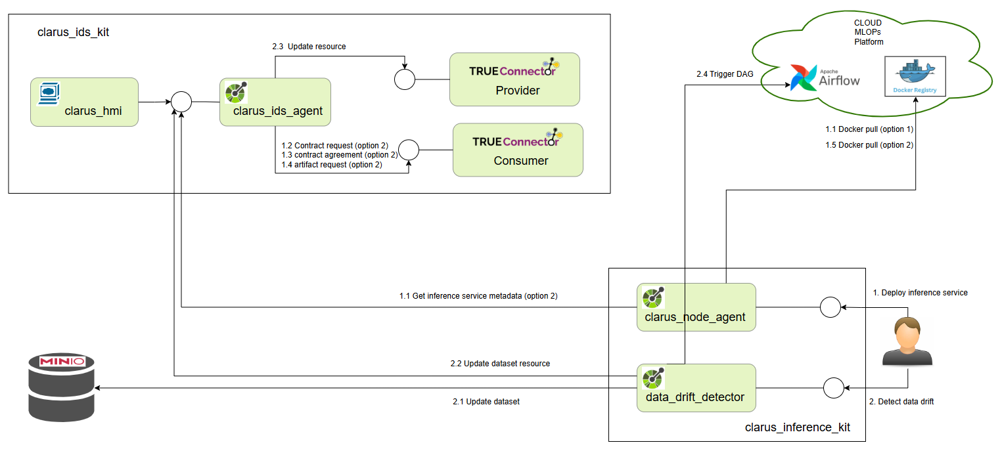
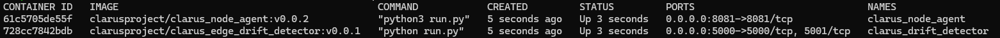
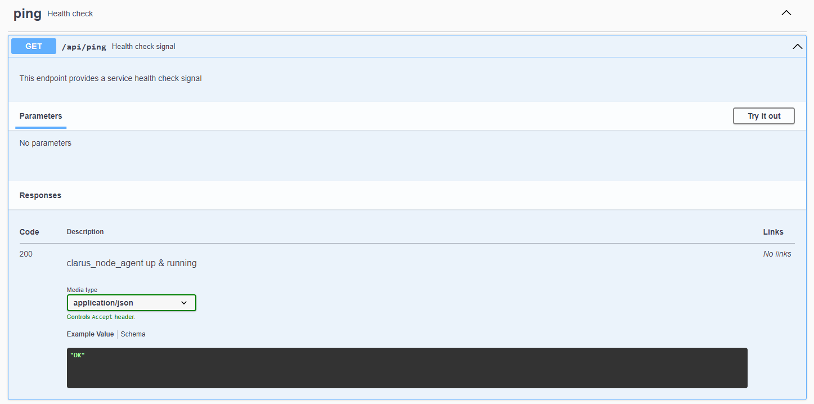
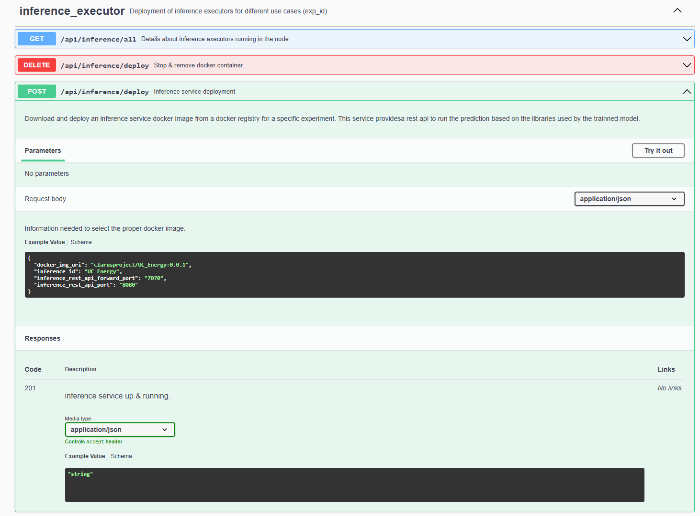

# clarus_inference_kit

This repository contains the docker-compose file needed to install & deploy the edge services related with the inference execution & monitoring at pilot's edge. Two services are provided.
 
 - clarus_node_agent: Inference image downloader service. This service allows the download of an inference image and the execution as a docker container. Two options are available.
  
   1. Inference service is downloaded directly from Docker registry. The user needs to know the location of the image and the Rest port where the port in the image where inference is provided.
   2. Location and port are shared as a resource through Clarus Data Space 


 - data_drift_detector: This service allows to detect data drift in data streams and trigger model retraining workflows using Apache Airflow. The system includes functionalities for reading data from MinIO, detecting data drift using Evidently, updating reference data with the new data, and integrating with IDS providers and Airflow for retraining.


 


## Requirements
- Linux machine with  8 GB RAM and 70 GB Disk and connection to Internet 
- Ubuntu 22 or higher
- Docker version 23.0.5 or above installed
- Docker-compose version 1.29.2 or above installed
- MLOPs platform Docker registry (deployed at 34.250.205.215:5001) configured as insecure-registry in /etc/docker/daemon.json
- Docker network clarus_inference_network should exist in docker
- clarus_ids_kit should be deployed to use data_drift_detector service
- clarus_ids_kit (branch clarus_ids_kit_2c) is mandatory when using clarus_node_agent option2

## Deployment 
The content needed for the deployment is available in the Clarus github repository https://github.com/CLARUS-Project and the images used are in the Clarus docker hub repository https://hub.docker.com/repositories/clarusproject.
The credentials to pull images from docker hub  are saved in the Polimi repository.

### Clone repository
- Clone clarus_node_agent
    ```
    ./git clone https://github.com/CLARUS-Project/clarus_inference_kit
    ``` 

### Add docker registry in Training Platform as an insecure registry
- Move to file /etc/docker/daemon.json (create if it doesn´t exist)
- Add in the "insecure-registries" entry
  
  ```
    {
      "insecure-registries": [
          "34.250.205.215:5001"
      ]
    }
    ```
- Restart docker
    ```
    sudo systemctl restart docker 
    ```  

### Create docker network

- Type
  
  ```
      sudo docker network create --driver=bridge clarus_inference_network
    ```

### Start services
Configure the environmental variables: 

#### Airflow Configuration

- **`AIRFLOW_IP`**: The IP address of the Airflow server.
- **`AIRFLOW_PORT`**: The port where the Airflow server is running.
- **`ID_AIRFLOW_DAG`**: The ID of the Airflow DAG that will be triggered for model retraining.
- **`AIRFLOW_USER`**: The username used to authenticate with the Airflow server.
- **`AIRFLOW_PASSWORD`**: The password used to authenticate with the Airflow server.

#### MinIO Configuration

- **`MINIO_IP`**: The IP address of the MinIO server.
- **`MINIO_PORT`**: The port where the MinIO server is running.
- **`MINIO_USER`**: The username used to authenticate with the MinIO server.
- **`MINIO_PASSWORD`**: The password used to authenticate with the MinIO server.
- **`MINIO_BUCKET`**: The name of the MinIO bucket where datasets are stored.
- **`MINIO_REF_DATA`**: The path within the MinIO bucket to the reference dataset (e.g., `uc_wine/winequality-red.csv`).
- **`MINIO_NEW_DATA`**: The path within the MinIO bucket to the new dataset that will be compared against the reference dataset (e.g., `uc_wine/winequality-red-new.csv`).
- **`MINIO_REPORT_PATH`**: The path within the MinIO bucket where drift reports will be saved.

#### IDS Provider Configuration

- **`EXPERIMENT_ID`**: The unique identifier for the experiment used in IDS (e.g., `Clarus_RedWine_experiment`).
- **`IDS_PROVIDER_IP`**: The IP address of the IDS provider server.
- **`IDS_PROVIDER_PORT`**: The port where the IDS provider server is running.

Move to the folder where the repo has been cloned.
- Login in Dockerhub using the clarusproject credentials provided in the project
    ```
    docker login --username clarusproject
    ```


- Execute docker-compose file in the folder
    ```
    docker-compose up -d
    ```

- Once docker-compose execution is finished, the services shall be up and running. To check it, write in terminal type in terminal
    ```
    docker ps -a
    ```
You shall see next services up:




## Inference downloader service usage

Once the service is up and running, it provides a REST API that can be used for other processes running in the pilot plant machines. The REST API can be reached with a web browser at http://<IP_where_clarus_node_agent_is_deployed>:8081/swagger

A postman collection ClarusInference.postman.collection is provided to access the services

These are the functionalities covered by the REST API.


- [x] /api/ping. This path is for health check support
       
  


 
- [x] /api/inference/deploy (POST).
   This path will pull an inference docker image and  run it as a service in a docker container. The body request need two parameters:
    ```
    "docker_img_uri":"Docker image location",
    "inference_id": "Unique Inference identifier. Use as container name", 
    "inference_rest_api_port": "Inference image internal rest api port",
    "inference_rest_api_forward_port": "inference image host rest api port"
    ```
   Optionally an ‘env’ property can be added. This property is a list of up to 8 environment variables needed in the execution of the inference service.

  ```
    "docker_img_uri":"Docker image location",
    "inference_id": "Unique Inference identifier. Use as container name",
    "inference_rest_api_port": "Inference image internal rest api port",
    "inference_rest_api_forward_port": "inference image host rest api port",
    "env":{
      "env1":"envValue1",
      "env2":"envValue2",
      "env3":"envValue3",
      "env4":"envValue4",
      "env5":"envValue5",
      "env6":"envValue6",
      "env7":"envValue7",
      "env8":"envValue8",

    }
    ```


- [x] /api/inference/deploy (DELETE).
This path will stop and remove an inference service container. The path requires the next mandatory parameter.
    ```   
    "inference_id": Inference identifier to remove. 
    
    ```

- [x] /api/inference/all (GET).
This path will provide information about the inference containers that are running in the host where the node agent is deployed. The information contains Inference ID and port where the execution service is provided.

  Update image


## Data drift service usage
The objective of this service is to identify the existence of datadrift in the data and proceed to retrain the model, so that it adjusts to this new data, and does not become obsolete over time.
What is needed for the execution to work? The first step is to locate in the corresponding Minio paths the reference dataset and the new dataset on which it will be analyzed if there is a drift with respect to the first dataset mentioned.


- [x] /api/detect_data_drift (GET).
Below is the process that occurs when you call this endpoint:

1. **Read Data**:
   - The API retrieves the reference dataset from MinIO at the path specified in the variable `MINIO_REF_DATA` and the new dataset from the path specified in `MINIO_NEW_DATA`.
   - MinIO is accessed using the `MINIO_IP`, `MINIO_PORT`, `MINIO_USER`, and `MINIO_PASSWORD` variables for authentication.

2. **Detect Data Drift**:
   - The datasets are compared using the Evidently library to determine if there is a significant drift in the new dataset with respect to the reference dataset.
   - If drift is detected:
     - A report is generated and saved in MinIO at the path defined in `MINIO_REPORT_PATH`.
     - The reference dataset in MinIO is updated with the new dataset.

3. **Update IDS**:
   - The IDS is updated with data for the new dataset. The IDS provider is accessed using the variables:
     - `IDS_PROVIDER_IP`: The IP address of the IDS provider.
     - `IDS_PROVIDER_PORT`: The port of the IDS provider.
     - `EXPERIMENT_ID`: The unique identifier for the experiment associated with the dataset.

4. **Trigger Retraining**:
   - An Airflow DAG specified by `ID_AIRFLOW_DAG` is triggered to retrain the model if drift is detected. The Airflow server is accessed using:
     - `AIRFLOW_IP` and `AIRFLOW_PORT` for server connection.
     - `AIRFLOW_USER` and `AIRFLOW_PASSWORD` for authentication.
   - When retraining the model, it must be taken into account that a previously trained model must exist for the flow to work.
 
5. **Response**:
   - The response from the API indicates whether drift was detected and whether retraining was triggered:
     ```json
     {"message": "Drift detected and retraining triggered"} (if drift is detected).
     {"message": "Drift NOT detected"} (if no drift is detected).
